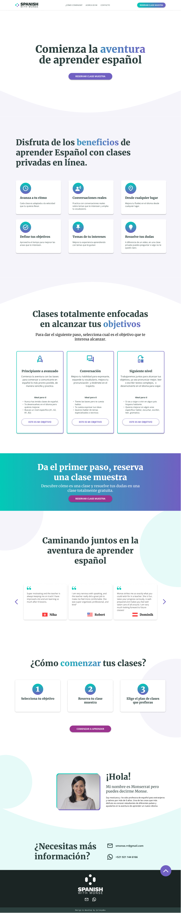

# Spanish with Monse

This is a projects for a spanish teacher to handle her student's scheduled.

## Table of contents

- [Overview](#overview)
  - [The challenge](#the-challenge)
  - [Links](#links)
- [My process](#my-process)
  - [Built with](#built-with)
  - [Useful resources](#useful-resources)
- [Author](#author)

## Overview

### The challenge

Users should be able to:

- View the optimal layout for the site depending on their device's screen size
- See hover states for all interactive elements on the page

### Links

- Solution URL: [Solution URL](https://github.com/vianydev/spanish-with-monse)
- Live Site URL: [Live site URL](https://your-live-site-url.com)

## My process

### Built with

- Semantic HTML5 markup
- CSS custom properties
- Flexbox
- CSS Grid
- Mobile-first workflow
- [React](https://reactjs.org/) - JS library
- [i18next](https://react.i18next.com/) - internationalization framework for React
- [React Router](https://reactrouter.com/) - To handle routes
- [Font Awesome](https://fontawesome.com/) - Icons Library
- [Font Source](https://fontsource.org/) - Fonts Library
- [React Calendly](https://github.com/tcampb/react-calendly) -Calendly integration for React apps

### Useful resources

- [React Router Configuration](https://www.copycat.dev/blog/reactjs-navigation/#:~:text=React%20Router%20is%20a%20library,back%20button%20and%20page%20refresh.) - Great article to config your React Router
- [Local Storage](https://blog.logrocket.com/using-localstorage-react-hooks/) - Great article which helped meto handle with local storage for my users login.

- Twitter - [@vianydev](https://www.twitter.com/vianydev)
- Linkedin - [@vianydev](https://www.linkedin.com/in/vianydev/)
- Github - [@vianydev](https://github.com/vianydev)

